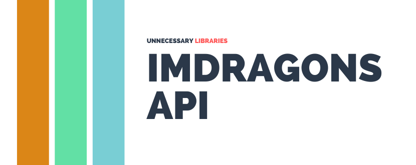
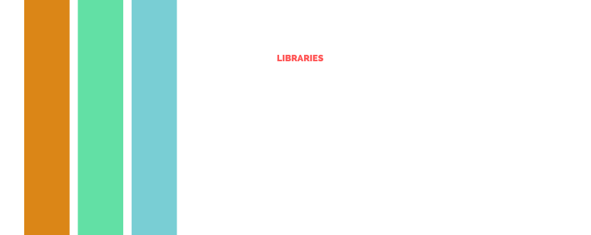

<p align="center">
  <a href="#gh-light-mode-only">
    
  </a>
  <a href="#gh-dark-mode-only">
    
  </a>
</p>
<p align="center">An API that allows for instant access to a massive database of <br> infomation regarding the band Imagine Dragons!</p>
</p>
<p align="center">
  <a href="#about">About</a> •
  <a href="#prerequisites">The API</a> •
  <a href="#links">Links</a> •
  <a href="#credits">Credits</a>
</p>

# 👋 About
Created on April 24th, 2021 by [RobbiDev](https://github.com/robbidev). ImDragonsAPI was created to give fans an all in one place for a fast, and constantly updating database of data regarding the band [Imagine Dragons](https://www.imaginedragonsmusic.com/#/). Instantly giving results back and no longer dealing with the painstaking process of copying and pasting websites/wikis!

# 💻 The API
ImDragonsAPI was also designed to be a beginner friendly tool for new aspiring developers. A public and open source REST API anyone can use to start gaining skills within software development. Thats why we developed our database with a very simple to use structure. 

Examples projects you can try:
- Making a Discord Data bot that gives Information regarding the band
- Twitter bot that Tweets out upcoming band Events
- Imagine Dragons news website
- Retrieving music streaming services data with the API
- Creating an Imagine Dragons Theme Website to learn front-end and Back-end integration

**...and So much more.**

# 🚀 Usage
There are many different way to use and manipulate our API. Since its a open api, you can access it from about almost anywhere, As long as your enviorment/code supports HTTP requests.

Main API URL
```
https://api.imdragons.com/v2/
```
Example of the ```/band``` endpoint.
```
https://api.imdragons.com/v2/band
```

Example of the ```/band``` endpoint in JSON.
```json
{
  "api": "ImDragonsAPI",
  "Status": 200,
  "data": {
    "biography": "Imagine Dragons is an American pop rock band from Las Vegas, Nevada, consisting of lead vocalist Dan  Reynolds, lead guitarist Wayne Sermon, bassist Ben McKee, and drummer Daniel Platzman. The band gained exposure with the release of their debut studio album Night Visions in 2012, which resulted in the chart-topping singles 'It's Time' and 'Radioactive'. Imagine Dragons' music is known for its blend of rock, electronic, and pop elements.",
    "origin": "Las Vegas, Nevada, United States",
    "formation_year": 2008,
    "active_years": "2008-present",
    "genres": ["Alternative rock", "Indie rock", "Electronic rock"],
    "labels": ["Interscope Records", "KIDinaKORNER"],
    "members": ["Dan Reynolds", "Wayne Sermon", "Ben McKee", "Daniel Platzman"],
    "past_members": ["Andrew Tolman", "Brittany Tolman", "Theron 'T' Thomas", "Dave Lemke"],
    "associated_acts": ["Egyptian", "X Ambassadors"],
    "awards": [
      "Grammy Award for Best Rock Performance (2014)",
      "American Music Award for Favorite Alternative Artist (2013)",
      "Billboard Music Award for Top Duo/Group (2019)"
    ],
    "notable_songs": ["Radioactive", "Demons", "Believer", "Thunder", "Whatever It Takes"],
    "instrumentation": {
      "lead_vocals": "Dan Reynolds",
      "lead_guitar": "Wayne Sermon",
      "bass_guitar": "Ben McKee",
      "drums": "Daniel Platzman"
    },
    "discography": {...},
    "socials": {...}
  }
}
```

## Documentation
See our dedicated website for our documentation, or you can view our documentation files:
- [Website](https://docs.unnecessarylibraries.com/) (Work in Progress)
- [Files](https://github.com/unnecessarylibraries/ImDragonsAPI/tree/main/docs)

## Supported Languages

| Language   | Name         | Version | Link  |
| ---------- | ------------ | ------- | ------|
| Javascript | ImDragons.JS |   WIP   | [Click Here](https://github.com/RobbiDev/imagine-dragons.js)|

Want to help expand our supported libraries? Don't be afraid to develop your own library, or contribute to existing libraries. Look at our contributing policy to learn more about adding your own additions!

# Links
- [Github](https://github.com/unnecessarylibraries)

# Credits
- [RobbiDev](https://github.com/pengyofficial) - Lead Programmer
- [Imagine Dragons](https://www.imaginedragonsmusic.com/#/) - The Creator of it all


